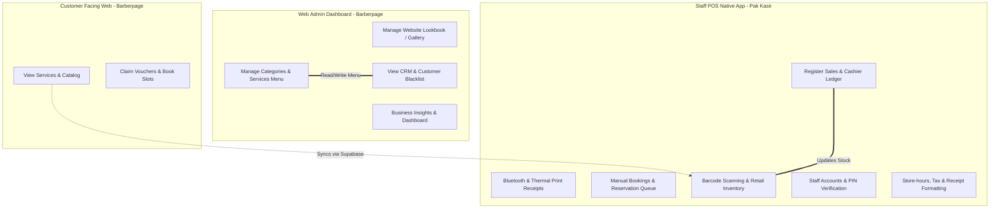

# Pak Kasir & Barberpage Ecosystem Integration Analysis

This document provides a comprehensive technical audit of the synchronization, integration gaps, overlapping functions, and architectural recommendations for the **Pak Kasir** (Staff POS) and **Barberpage** (Customer Portal / Web Admin) ecosystem.

---

## 🔄 1. Synchronization Status

Both applications share a single cloud-hosted Supabase database (`ifawbnmbmedwwsmaqzxm.supabase.co`). Below is the current synchronization map:

| Entity / Table | Source of Truth | Sync Direction | Status / Inconsistencies |
| :--- | :--- | :--- | :--- |
| **`services`** (Services Menu) | Barberpage Admin Panel | `Barberpage Web` → `Supabase` → `Pak Kasir (Dexie)` | **Fully Synced.** Service entries map locally to POS `products` with sentinel `categoryId: 999`. Obsolete remote items are pruned locally. |
| **`products`** (Retail Inventory) | Pak Kasir POS App | `Pak Kasir (Dexie)` ⇄ `Supabase` → `Barberpage Web` | **Fully Synced.** POS handles sales and inventory updates which dynamically reflect in the web retail catalog. |
| **`bookings`** (Reservations) | Customer / Staff | `Barberpage Web` ⇄ `Supabase` ⇄ `Pak Kasir (Dexie)` | **Fully Synced.** Real-time Postgres subscriptions alert POS of new client slots. Updates like completions sync back immediately. |
| **`customers`** (Loyalty CRM) | Pak Kasir / Web | `Pak Kasir (Dexie)` ⇄ `Supabase` ⇄ `Barberpage Web` | **Fully Synced.** Awarded points, visits count, and profile metrics update bi-directionally. |
| **`discounts`** (Promo Programs) | Pak Kasir POS App | `Pak Kasir (Dexie)` ⇄ `Supabase` → `Barberpage Web` | **Integrated.** Modified or added promotions in the POS settings automatically propagate to the consumer website's Promo Ticker. |
| **`blacklist`** (Blocked Numbers) | Web Admin Insights | `Barberpage Web` → `Supabase` | **Unsynchronized Gap.** Defined on the Web Admin but not checked locally by POS when staff creates manual reservations. |
| **`settings`** (Store Hours) | Pak Kasir Settings | `Pak Kasir (Dexie)` ⇄ `Supabase` → `Barberpage Web` | **Broken Sync Gap.** The remote `settings` table on Supabase is empty, causing Web to fall back to conflicting hardcoded variables. |

---

## ⚠️ 2. Core Gaps & Critical Inconsistencies

### A. Operational Hours & Holiday Configuration (Broken Sync)
1. **Empty Cloud Table:** The Supabase `settings` table is currently empty (`[]`). This occurs because the POS (`pak_kasir`) only attempts to push settings updates to Supabase if the cashier is logged in to a valid Supabase cloud session, and uses a standard `.update()` targeting `id = current.id`. Since the local ID is `1` and no row with `id = 1` exists in the remote database, update queries fail silently.
2. **Hardcoded Web Overrides (Saturday Issue):** Because the cloud `settings` table is empty, `barberpage`'s `useStoreSettings.js` falls back to its default configurations (which lists Saturday as open). However, the booking scripts (`MobileBooking.jsx` and `BookingModal.jsx`) have **hardcoded** local `defaultDailyHours` arrays that set **Saturday as a holiday** (`isHoliday: true`). 
   * **Consequence:** This hardcoding forces the date picker to skip Saturday and alerts clients that the shop is closed on Saturday, completely ignoring any operational hour changes saved in the database.

### B. Customer Blacklist Enforcements
* **What's broken:** While `barberpage` contains a "Daftar Hitam" panel (`AdminInsights.jsx`) to ban specific mobile numbers from reserving slots, this table is **never queried** by the POS app during manual booking creation (`OnlineBookingsPage.tsx`).
* **Consequence:** Banned clients can bypass online reservation blocks simply by calling the shop and asking a cashier to book them manually.

---

## ⚖️ 3. Overlapping Features & Redundancies

### A. Dual Analytics Panels
* **Overlapped:** Both the `barberpage` Admin (`AdminInsights.jsx` - *Laporan Bisnis* tab) and the POS `pak_kasir` (`ReportsPage.tsx` and `StudioManagementPage.tsx` - *Analitik* tab) generate financial reports, service popularity charts, payment distribution breakdown, and capster performance graphs.
* **Problem:** If local database entries in `pak_kasir` are unsynced (due to running offline), the analytics in the POS app will differ from those on the Web Admin, causing merchant confusion.

### B. Loyalty Settings Management
* **Overlapped:** Loyalty points ratio settings (`points_per_1000_spent`) can be updated from both `barberpage` (`AdminSettings.jsx`) and `pak_kasir` (`StudioManagementPage.tsx` - *Loyalitas* tab). This creates a race condition where settings can be overwritten by whichever screen saves last.

---

## 💡 4. Architectural Recommendations

To optimize performance, security, and user experience, we recommend separating features based on user role and deployment context:

### 📱 What should live in the Native POS App (Pak Kasir):
* **Cashier Ledgers & Ledger Actions:** Cash flow, opening/closing shifts, and operating registers.
* **Hardware Integrations:** Bluetooth/Thermal printing, native camera barcode scanning, and offline-first IndexedDB database cache.
* **Receipt Customization:** Header/footer print text, printer paper width, layout scaling adjustments, and currency formatting.
* **Daily Staff & Shift Management:** Cashier PIN configurations, active shift logs, and staff assignments.

### 💻 What should live in the Web Admin / Dashboard (Barberpage):
* **Marketing & Public Configurations:** Lookbook/gallery media, customer testimonials, location maps, and landing page hero settings.
* **Global Business Analytics:** Financial reporting charts (revenue, margins, customer acquisition cost) should reside on the web dashboard to allow managers/owners to check performance remotely without accessing active cash registers.
* **Menu Master List:** Setting up global service offerings (Haircuts, styling) and categorizations.

### ⚙️ How to resolve Sync and Gaps:
1. **Fix Saturday Booking Issue:** Remove the hardcoded `isHoliday: true` override in `MobileBooking.jsx` and `BookingModal.jsx`, and ensure the initial date default reads directly from `useStoreSettings.js` fallback configuration.
2. **Establish Single Settings Authority:** Either move operational hours to the Web Admin dashboard or write a migration query to ensure the POS app initializes a row in the Supabase `settings` table with `id = 1` during the first cloud sync event.
3. **Integrate Blacklist Verification in POS:** Add a query inside `OnlineBookingsPage.tsx` when saving manual reservations to warn/block staff if the customer's phone number matches a blacklisted entry.
